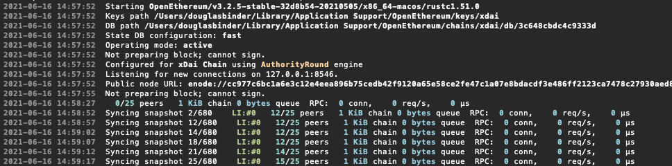

# Running your own xDAI node

## Running your own xDAI node

Dark Forest runs on the xDai blockchain. xDai like most blockchains is made up of a network of computers all talking to each other. Running your own "node" is just running a computer in the network. Having a dedicated node is a crucial part of managing a large empire. The investment to getting a node started can feel like a lot, but you can use it across rounds and is a huge advantage! The full node sync will take a couple days, but it should be hands off once it gets started!

## You want to pay for it

Use [QuickNode](https://www.quicknode.com/)! 

They'll get you setup with a dedicated node instance fast but it can be more money than some folks want to pay.

## You have an extra computer that could run a node \(With atleast 30Gb of memory\)

Check this out for another guide setting up a node: [https://forum.1hive.org/t/run-your-own-local-xdai-node-updated-for-berlin-hardfork/2875](https://forum.1hive.org/t/run-your-own-local-xdai-node-updated-for-berlin-hardfork/2875)

### Download the node software.

Download the software for your OS here [https://github.com/openethereum/openethereum/releases](https://github.com/openethereum/openethereum/releases)

### Extract the Files \(Just unzip them\)

### Open up your Terminal.app

Navigate into the extracted files folder

### Start Syncing your Node

Before your node can start participating in the network it needs to get all of the relevant data. Fetching all of this data in a secure manner can take a few days. By setting `--warp-barrier=Some Block Height` we can fast forward through a lot of the historical data but you might have to stop and restart your node software before it initializes correctly.

To start your node software copy this into your terminal. `./openethereum --chain xdai --jsonrpc-port=8545 --jsonrpc-cors=all --jsonrpc-interface=all --jsonrpc-hosts=all --jsonrpc-apis=web3,eth,net,parity --ws-interface=all --ws-apis=web3,eth,net,parity,pubsub --ws-origins=all --ws-hosts=all --ws-max-connections=10 --max-peers=100 --warp-barrier=16000000`

If after a minute or so the output in your terminal does not look like it is `Syncing Snapshots` like the screenshot below, you should stop your program and restart your node software.  

#### You might need to do some permissions stuff

* eg. `chmod u+x ./openethereum`
* Or enable your system security to run apps from the internet \(on Mac\)

## Running on a hosted or cloud machine

WIP

